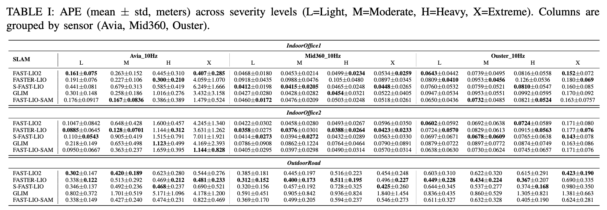
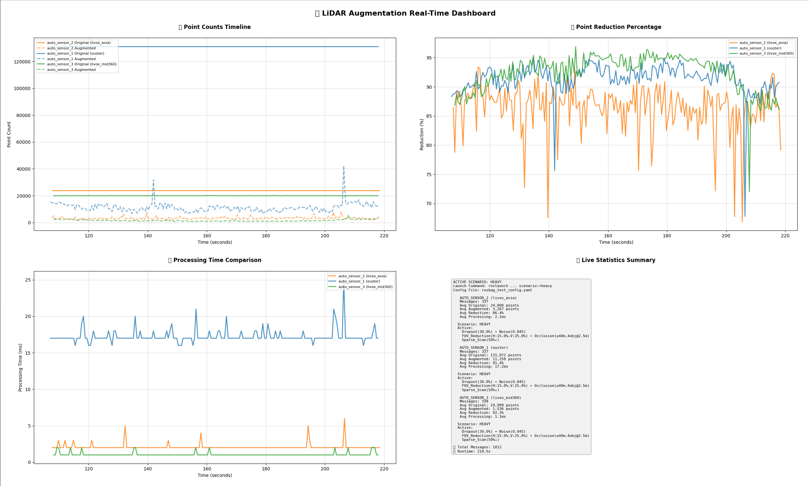
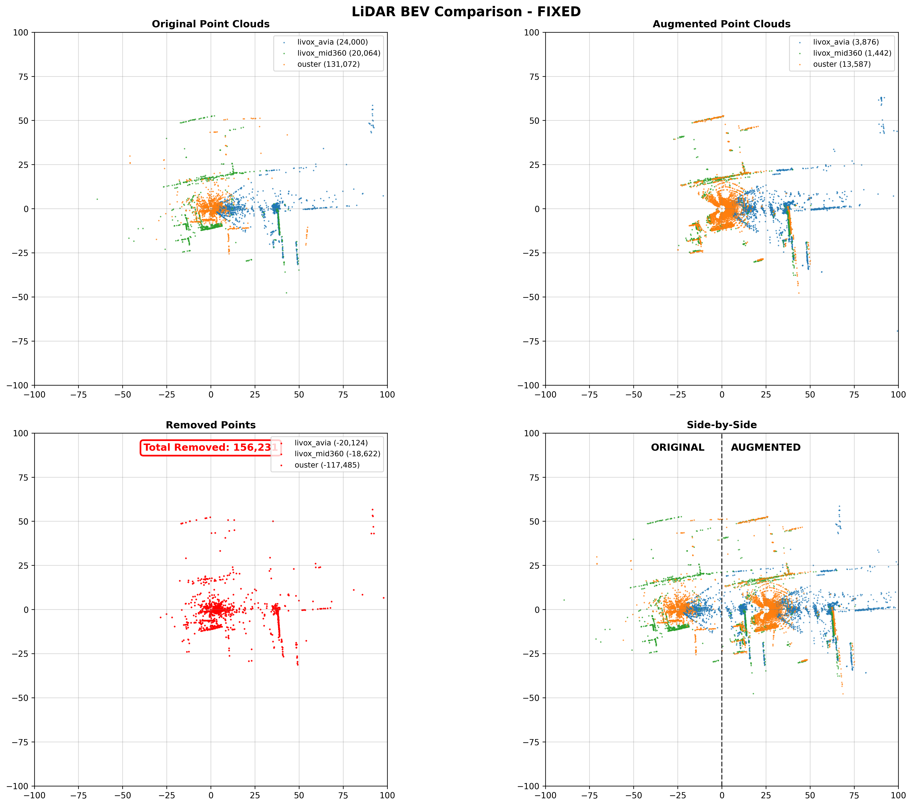

# Lidar Augmentation Framework (ROS Noetic, C++)

[](https://github.com/mawuto/lidar_augmentation_cpp_ws/actions)


- Physics-aware LiDAR augmentation and simulation framework in **C++/ROS (catkin)** for stress-testing SLAM algorithms under controlled degradations including **dropout**, **Gaussian/outlier noise**, **FoV occlusion**, **motion distortion**, and **sparsification**.  
- Developed as part of the **LiDAR Variability and Robust SLAM Benchmarking** research project, it provides real-sensor physics with reproducible YAML configurations for consistent evaluation across datasets and SLAM pipelines.

---

## 🌐 Overview

- A **real-time, physics-aware LiDAR degradation pipeline** for evaluating SLAM robustness (e.g., **FAST-LIO2**, **FASTER-LIO**, **S-FAST-LIO**, **FAST-LIO-SAM**, **GLIM**) across Livox Avia, Mid-360, and Ouster LiDARs.  
- It applies realistic perturbations directly on `sensor_msgs::PointCloud2` topics to test algorithms under reproducible adverse sensing conditions.
- **ROS-native design:** works with both recorded rosbag files and live LiDAR topics (same node, same configuration).

---

## ⚙️ Features

- **Physics-based degradations:** dropout, Gaussian/outlier noise, occlusion, FoV reduction, motion distortion.
- **Sensor-specific modeling:** automatically detects Livox or Ouster data formats.
- **Hybrid C++/Python design:** C++ for real-time augmentation; Python for visualization and statistics.
- **YAML-driven configuration:** configurable severity tiers (`light → extreme`) and reproducible seeds.
- **SLAM-compatible outputs:** publishes augmented `sensor_msgs/PointCloud2` topics ready for SLAM input.
- **Cross-sensor benchmarking:** evaluate SLAM across multiple LiDAR architectures.
- **IMU-aware motion distortion:** integrates `/imu` using trapezoidal integration to estimate per-point linear and angular velocity.

---

## 🧩 Repository Layout

```bash
.
├── CITATION.cff
├── LICENSE
├── README.md
├── results
│   └── images
│       ├── bev_comparison.png
│       ├── dashboard_overview.png
|       ├── table_ape_results.png
│       └── severity_outdoor_examples
│           ├── bev
│           │   ├── light
│           │   │   ├── lidar_bev_1.png
│           │   │   └── lidar_bev_2.png
│           │   ├── moderate
│           │   │   ├── lidar_bev_1.png
│           │   │   ├── lidar_bev_2.png
│           │   │   └── lidar_bev_3.png
│           │   ├── heavy
│           │   │   ├── lidar_bev_1.png
│           │   │   ├── lidar_bev_2.png
│           │   │   └── lidar_bev_3.png
│           │   └── extreme
│           │       ├── lidar_bev_1.png
│           │       ├── lidar_bev_2.png
│           │       └── lidar_bev_3.png
│           └── dashboard
│               ├── light
│               │   ├── image_light_1.png
│               │   ├── image_light_2.png
│               │   └── image_light_3.png
│               ├── moderate
│               │   ├── image_moderate_1.png
│               │   ├── image_moderate_2.png
│               │   └── image_moderate_3.png
│               ├── heavy
│               │   ├── image_heavy_1.png
│               │   ├── image_heavy_2.png
│               │   └── image_heavy_3.png
│               └── extreme
│                   ├── image_extreme_1.png
│                   ├── image_extreme_2.png
│                   └── image_extreme_3.png
└── src
    └── lidar_augmentation
        ├── CMakeLists.txt
        ├── config
        │   └── rosbag_test_config.yaml
        ├── include
        │   └── lidar_augmentation
        │       ├── augmentation_methods.h
        │       ├── imu_synchronizer.h
        │       ├── lidar_augmenter_node.h
        │       └── point_cloud_processor.h
        ├── launch
        │   └── rosbag_augmentation.launch
        ├── package.xml
        ├── rviz
        │   └── rosbag_visualization.rviz
        ├── scripts
        │   └── tools
        │       ├── lidar_augmentation_statistics_subscriber.py
        │       ├── lidar_augmentation_visualizer.py
        │       ├── lidar_bev_visualizer.py
        │       ├── stat.txt
        │       └── topic_diagnostics.py
        ├── src
        │   ├── augmentation_methods.cpp
        │   ├── imu_synchronizer.cpp
        │   ├── lidar_augmenter_node.cpp
        │   ├── lidar_augmenter_node_main.cpp
        │   └── point_cloud_processor.cpp
        └── test
            ├── cpp
            │   ├── tes_results.txt
            │   ├── test_augmentation_methods.cpp
            │   ├── test_integration.cpp
            │   └── test_point_cloud_processor.cpp
            └── launch
                └── test_integration.launch

```
---

## 🧱 Dependencies

### ROS
- ROS Noetic (Ubuntu 20.04)
- `roscpp`, `rospy`, `std_msgs`, `sensor_msgs`, `geometry_msgs`
- `tf2`, `tf2_ros`, `tf2_eigen`, `message_filters`
- `pcl_ros`, `pcl_conversions`, `roslib`, `diagnostic_msgs`, `visualization_msgs`

### System Libraries
- PCL ≥ 1.8 (`libpcl-all-dev`)
- Eigen3 (`libeigen3-dev`)
- yaml-cpp (`libyaml-cpp-dev`)
- Boost (system, filesystem, thread)
- Python tools: `numpy`, `scipy`, `matplotlib`, `yaml`, `opencv-python`

> Install all automatically using `rosdep` (see below).

---

## 🛠️ Build

```bash
# 1. Clone
mkdir -p ~/lidar_augmentation_cpp_ws/src
cd ~/lidar_augmentation_cpp_ws/src
git clone https://github.com/mawuto/lidar_augmentation_cpp_ws.git lidar_augmentation
cd ..

# 2. Install dependencies
sudo apt update
sudo apt install -y python3-rosdep
sudo rosdep init || true
rosdep update
rosdep install --from-paths src --ignore-src -r -y

# 3. Build
catkin_make -DCMAKE_BUILD_TYPE=Release
source devel/setup.bash

# 4. Make Python tools executable
cd ~/lidar_augmentation_cpp_ws/src/lidar_augmentation
chmod +x scripts/tools/*.py
```
---

## 🚀 Run Workflow (multi-terminal)

**Important:** Always launch all nodes first, then press SPACE in the rosbag terminal to start playback.

```bash
# Terminal 1 – Start ROS master
roscore

# Terminal 2 – Play ROS bag / press SPACE after all other nodes are ready
rosbag play unitree_outdoor_tt.bag --clock --pause

# Terminal 3 – Launch Augmenter / Full parameter control
roslaunch lidar_augmentation rosbag_augmentation.launch publish_statistics:=true scenario:=moderate use_rviz:=false
# scenario options: light | moderate | heavy | extreme
    
# Quick scenarios
roslaunch lidar_augmentation rosbag_augmentation.launch scenario:=light
roslaunch lidar_augmentation rosbag_augmentation.launch scenario:=extreme

# set publish_statistics:=false if you do not need stats

# Terminal 4 – Launch SLAM (example: FAST-LIO2)
roslaunch fast_lio mapping.launch

# Terminal 5 – Visualization (2D)

python3 $(rospack find lidar_augmentation)/scripts/tools/lidar_augmentation_visualizer.py


# Terminal 6 – BEV Visualization
python3 $(rospack find lidar_augmentation)/scripts/tools/lidar_bev_visualizer.py
```
**Note on visualizers:** it may take a small delay before the output images appear. Sometimes a “matplotlib not responding” dialog can pop up. Click “Wait” and let the application finish processing.

```bash
# Optional
rosrun rqt_graph rqt_graph
```

## 🔁 Auxiliary Converters (when needed)
- Outdoor data: run the GNSS→pose converter (to produce ground truth/odom in the ROS frame).
- Livox series (Avia / Mid-360): run the PointCloud2→Livox custom converter so FAST-LIO family can ingest the stream.
(Ouster does not need this converter.)
- The exact converter commands and the metrics recording + evo_ape pipeline follow the procedures documented in the Multi-Modal LiDAR Dataset reproducibility guide (docs/pipelines/README.md).
- See:
	 - TIERS repo: https://github.com/TIERS/multi_modal_lidar_dataset

## 📂 Launch Files
The package uses a single production-ready launch file:

**`rosbag_augmentation.launch`**
- Auto-discovers all LiDAR sensors from running rosbag
- Supports pre-configured scenarios (light, moderate, heavy, extreme)
- Enables multi-sensor simultaneous processing
- Optional RViz visualization

**Usage:**
```bash  
roslaunch lidar_augmentation rosbag_augmentation.launch \
    scenario:=moderate \
    rviz:=false \
    debug:=false  
```

## 📄 Reproducing the RA-P Experiments

To reproduce the experiments reported in the paper:

1. Download the multi-modal LiDAR dataset (IndoorOffice1–2, OutdoorRoad).
2. Start `roscore` and play the rosbag with `--pause`.
3. Launch the augmenter:

   ```bash
   roslaunch lidar_augmentation rosbag_augmentation.launch \
       scenario:=heavy publish_statistics:=true use_rviz:=false
   ```
4.	Run your chosen SLAM system (FAST-LIO2, FASTER-LIO, S-FAST-LIO, GLIM, FAST-LIO-SAM).
5.	Evaluate the resulting trajectory with evo_ape as described in the paper.

## ⚙️ Configuration & Severities
Main YAML: config/rosbag_test_config.yaml
**Main Configuration File:**
- **Location:** `src/lidar_augmentation/config/rosbag_test_config.yaml`
- **Purpose:** Defines all severity scenarios (light→extreme) and sensor-specific parameters.
- **Active Scenario:** Set Severity (low → extreme) and visualization toggles directly in **launch/rosbag_augmentation.launch** file parameter `scenario:=<name>` 


- Common parameters (names may differ slightly with your YAML):
	-	augmentations.dropout.rate — point dropout ratio
	-	augmentations.noise.gaussian_std, augmentations.noise.outlier_rate
	-	augmentations.fov.horizontal, augmentations.fov.vertical
	-	augmentations.occlusion.{count,radius,dmin,dmax}
	-	augmentations.motion.{lin,ang} and/or IMU-driven sync
	-	sparse_scan.factor
	-	seed

## 🧵 Topics

Subscribed
	-	/<sensor>/points — sensor_msgs/PointCloud2
	-	/<sensor>/imu — sensor_msgs/Imu (optional for motion distortion / sync)

Published Topics:
- `/<sensor>/augmented_points` → `sensor_msgs/PointCloud2`
- `/lidar_augmentation/statistics` → `std_msgs/String` (JSON-encoded statistics)

(Exact names depend on your YAML/launch settings.)

## Verify Topics
```bash
rostopic list | grep augmented
# Should show: /ouster/points_augmented (or similar)
```
---

## 🐛 Troubleshooting  

```yaml

### Issue: "No topics detected"  

Always start rosbag with `--pause` flag, wait 5 seconds for topic propagation before launching augmenter.  

### Issue: "PCL timestamp warnings"

This is normal. The node suppresses these at L_ERROR level (see `lidar_augmenter_node_main.cpp`).  

### Issue: "RViz conflicts"  

Disable RViz in either augmenter launch (`use_rviz:=false`) OR SLAM launch, not both.  

### Issue: "Python scripts not executable" 

cd ~/lidar_augmentation_cpp_ws/src/lidar_augmentation
chmod +x scripts/tools/*.py

## Issue: "Statistics not publishing"
 
- Ensure publish_statistics:=true in launch command.
- Statistics publish rate defaults to **2Hz** to reduce CPU load.

### To increase statistics frequency ,in launch/rosbag_augmentation.launch, change:  

<param name="stats_publish_rate" value="2.0" />  <!-- Default 2Hz -->  

### To faster rate:  

<param name="stats_publish_rate" value="10.0" />  <!-- 10Hz for debugging if really needed -->

```

## 🖼️ Visualization & Tools

- RViz preset:

   ```bash  
  rviz -d $(rospack find lidar_augmentation)/rviz/rosbag_visualization.rviz   

   ```

- ⚠️ RViz toggle warning:

   - If you enable RViz in both this package and your SLAM launch, one may “take over” rendering.
   - Recommendation: keep RViz off in this package when using a SLAM’s built-in RViz.

- Diagnostics / stats / BEV:

    ```bash
  rosrun lidar_augmentation topic_diagnostics.py (only if needed)

  python3 $(rospack find lidar_augmentation)/scripts/tools/lidar_augmentation_visualizer.py

  python3 $(rospack find lidar_augmentation)/scripts/tools/lidar_bev_visualizer.py
    ```

## 📊 Evaluation & Metrics (follow the dataset pipeline)

Use the exact evaluation flow described in the Multi-Modal LiDAR Dataset reproducibility docs (docs/pipelines/README.md):
- 1.	Prepare converters (GNSS→pose; PointCloud2→Livox for Livox streams).
- 2.	Run SLAMs on the augmented outputs.
- 3.	Record estimated trajectory & ground truth (TUM format).
- 4.	Compute metrics with evo_ape (and other scripts listed in the dataset pipeline).
- 5.	Repeat across sensors and severity tiers; aggregate tables/boxplots.

Keep all nodes running before unpausing the bag. Only then press SPACE in the rosbag terminal.

## 🧪 Tests

- C++ unit/integration tests live under test/.
- Run (if you use tests in this workspace):

```bash
catkin_make run_tests
catkin_test_results build
```
(Primary benchmarking/metrics are produced through the dataset pipeline above, not via gtests.)

### 📊 APE Results Across Severity Levels

The following table summarizes APE (mean ± std, in meters) for  
five SLAM algorithms (FAST-LIO2, FASTER-LIO, S-FAST-LIO, GLIM, FAST-LIO-SAM)  
across four degradation severities (L/M/H/X) and three sensors (Avia, Mid360, Ouster).

<p align="center">
  
</p>

## 📸 Figures (Example Outputs)

Below are sample visualizations generated by this framework.

- **Dashboard overview** (OutdoorRoad, heavy scenario):  
  

- **BEV comparison (original vs augmented)**:  
  

Additional examples for each severity tier (BEV + dashboard) are provided in  
`results/images/severity_outdoor_examples/`.
